# Projeto de Interface

## User Flow

O fluxograma apresentado na figura 1 mostra o fluxo de interação do usuário pelas telas do sistema. Cada uma das telas deste fluxo é detalhada na seção de Protótipo de baixa fidelidade que se segue. 

  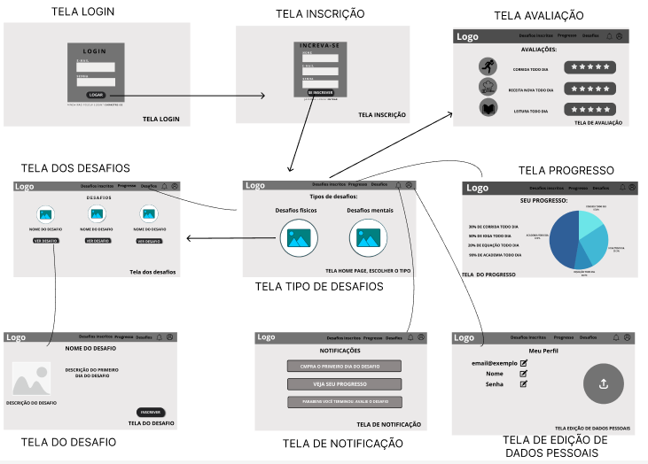

  
<figure> 
    <figcaption>Figura 1 - Fluxo de telas do usuário
</figure> 

## Protótipo de baixa fidelidade

As telas do sistema apresentam uma estrutura comum que é apresentada na figura 2. Nesta estrutura existem 2 blocos, descritos a seguir. São eles:
<ul>
  <li>Cabeçalho - local onde estão dispostos o nome da aplicação web e navegação principal do site (menu da aplicação);</li>
  <li>Conteúdo - apresenta o conteúdo da tela em questão;</li>
</ul>

<figure> 
  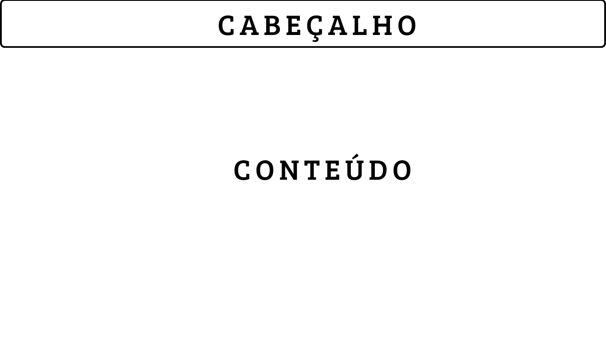Figura 2 - Estrutura padrão do site
</figure> 

<h3><b>Tela - Home page</b></h3>

A tela de home page apresenta as categorias "Mentais" e "Físicos" dos desafios. 

  
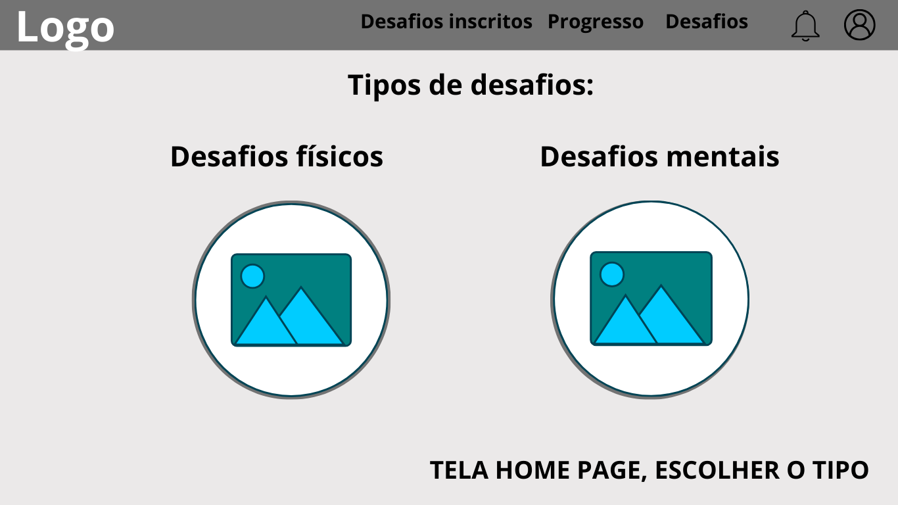

<figure> 
  <figcaption>Figura 3 - Tela home page
</figure> 

<h3><b>Tela - Desafios </b></h3>

 A tela dos desafios aparece quando o usuário escolhe a categoria que prefere .

  
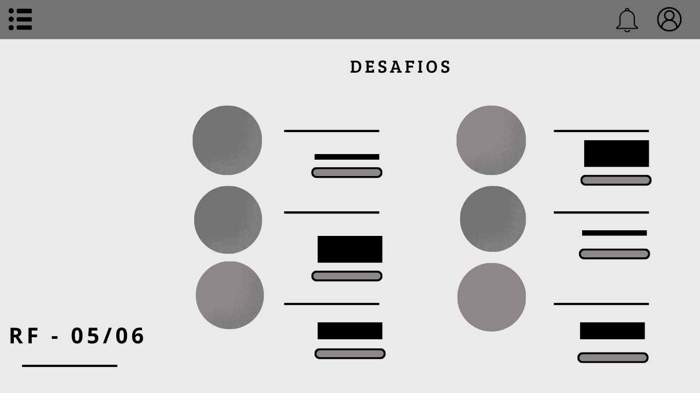

  
<figure> 
  <figcaption> Figura 4 - Tela dos desafios
</figure> 

<h3><b>Tela - Desafio selecionado</b></h3>

A tela de Desafio selecionado apresenta as informações sobre o desafio, e somente se o usuário iniciar o primeiro dia que a inscrição é realizada.

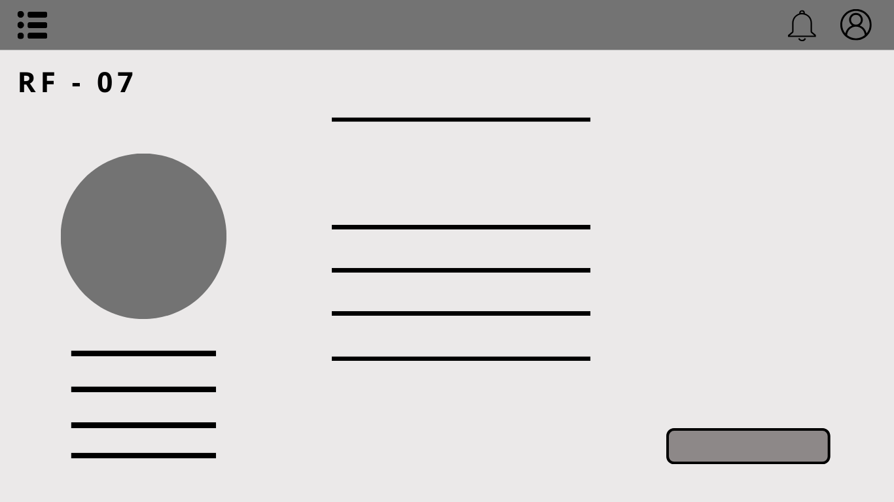

  
<figure>  
    <figcaption>Figura 5 - Tela Desafio selecionado      
</figure> 

<h3><b>Tela – Login</b></h3>

A tela de Login apresenta campos para a inserção do e-mail e da senha. 

  
  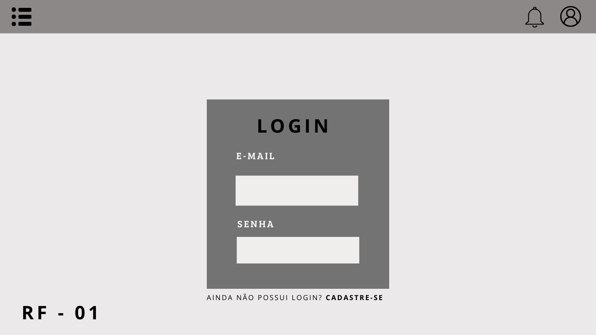

<figure> 
    <figcaption>Figura 6 - Tela de acesso à conta do usuário
</figure>

<h3><b>Tela – Cadastro</b></h3>

A tela de cadastro apresenta os seguintes campos para a inserção das informações pessoais do usuário: Nome, E-mail e senha.

  
  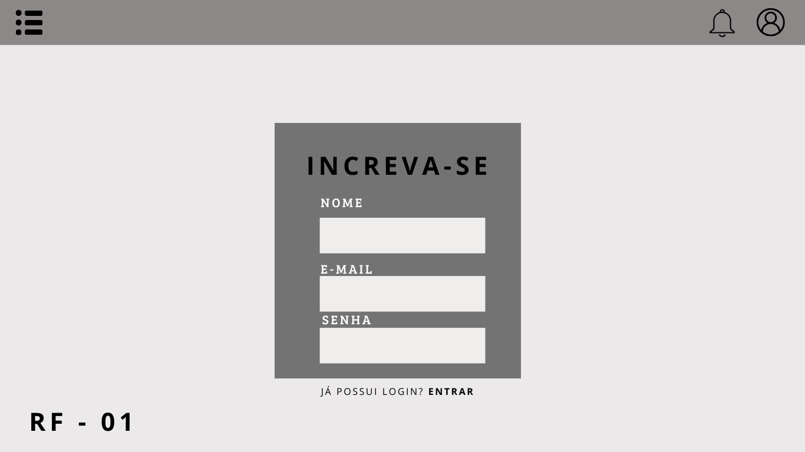

<figure> 
    <figcaption>Figura 7 - Tela de cadastro de usuários
</figure>

 
  
  <h3><b>Tela – Lembrete </b></h3>

A tela de Lembrete apresenta uma mensagem informando ao usuário para que ele se lembre de completar o desafio em que se inscreveu. 

  
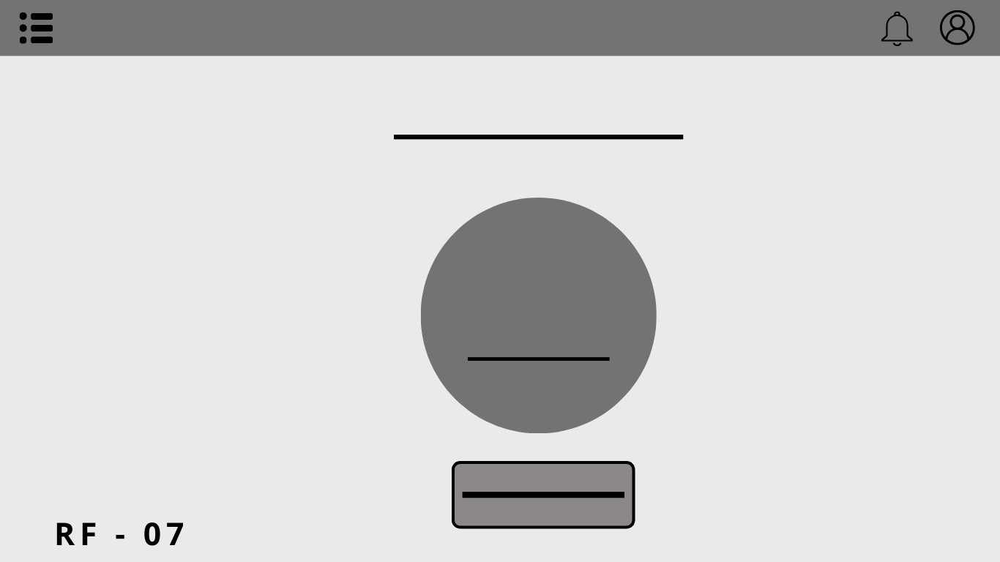

<figure> 
    <figcaption>Figura 8 - Tela Lembrete
</figure>

  <h3><b>Tela  – Alterações de dados pessoais </b></h3>

 A tela de alterações de dados pessoais permite ao usuário editar suas informações pessoais  

  

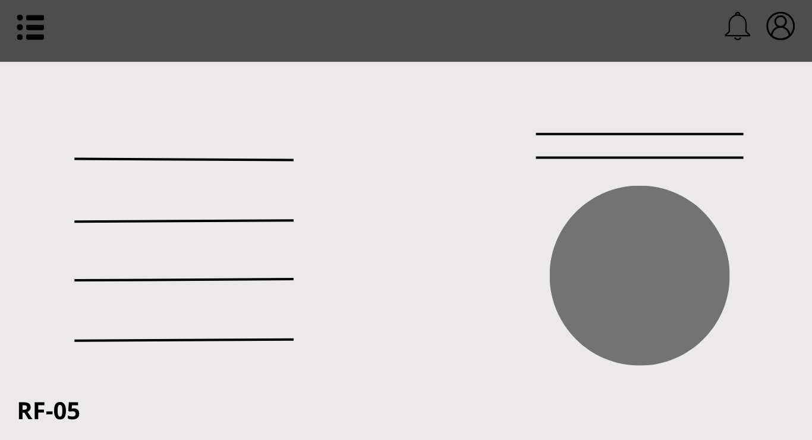

<figure> 
    <figcaption>Figura 9 - Tela alterações de dados pessoais 
</figure>
 

  <h3><b>Tela – Avaliação dos desafios realizados </b></h3>

 A tela de Avaliação dos desafios realizados permite o usuário avaliar os desafios para que a plataforma possa melhorar 

  
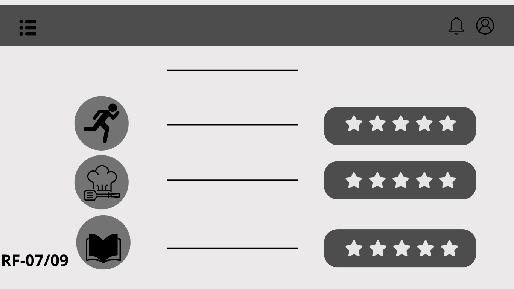

<figure> 
    <figcaption>Figura 10 - Avaliação dos desafios realizados 
</figure>

 

  <h3><b> Tela – Desafio concluído </b></h3>

 A tela de Desafio concluído é quando o usuário concluí os 30 dias de desafios 

  
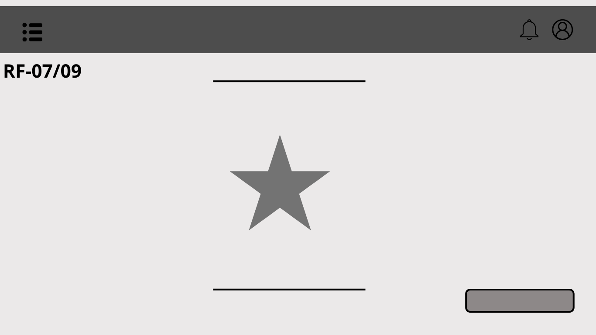

<figure> 
    <figcaption>Figura 11 -  Desafio concluído 
</figure>

