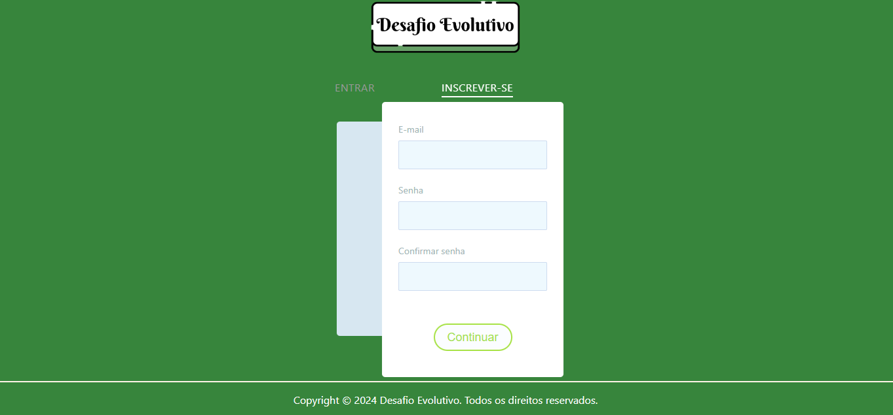

# Programação de Funcionalidades

Pré-requisitos: <a href="2-Especificação do Projeto.md"> Especificação do Projeto</a>, <a href="3-Projeto de Interface.md"> Projeto de Interface</a>, <a href="4-Metodologia.md"> Metodologia</a>, <a href="3-Projeto de Interface.md"> Projeto de Interface</a>, <a href="5-Arquitetura da Solução.md"> Arquitetura da Solução</a>

### Tela de Cadastro e Login (RF-01)

Responsável: Sharon e enzo

O acesso a tela de cadastro poderá ser feito através da opção de menu “Inscrever-se”. As estruturas de dados foram baseadas em HTML, CSS e JS.

Exemplo da tela de cadastro: 

Exemplo da tela de login: 

#### Requisito atendido

RF-001: O sistema deve permitir o cadastro e login na plataforma.

#### Artefatos da funcionalidade

●index.html

●cadastrologin.css

●cadastrologin.js

●scriptlogin.js

### Tela Área do usuário (RF-02)

Responsável: Sharon, Artur e Enzo

O acesso a tela área do usuário é liberado quando estiver logado. As estruturas de dados foram baseadas em HTML, CSS e JS.

Exemplo da tela área do usuário: 

#### Requisito atendido

RF-02	O sistema deve permitir que o usuário faça mudanças nos seus dados pessoais

#### Artefatos da funcionalidade

●areadousuario.html

●areadousuario.css

●areadousuario.js

### Tela de Home Page (RF-03)

Responsável: Almeida

O acesso a tela de Home Page é liberado quando estiver logado. As estruturas de dados foram baseadas em HTML, CSS e JS.

Exemplo da tela de Home Page: 

#### Requisito atendido

RF-03	O sistema deve ter categorias entre os desafios entre físicos e mentais.

#### Artefatos da funcionalidade

●homepage.html

●homepage.css

●homepage.js

### Tela de Desafios (RF-004 e RF06)

Responsável: Gustavo

O acesso a tela de desafios é liberado quando estiver logado. As estruturas de dados foram baseadas em HTML, CSS e JS.

Exemplo da tela de Desafios: 

#### Requisito atendido

RF-04	O sistema deve apresentar uma imagem relacionada a cada desafio.
RF-06	O sistema deve mostrar nível de dificuldade dos desafios entre fácil, médio e avançado.

#### Artefatos da funcionalidade

●desafiosfisicos.html

●desafiosfisicos.css

### Tela de Inscrição no Desafio (RF-05)

Responsável: Gustavo e Almeida

O acesso a tela de Inscrição no Desafio é liberado quando estiver logado. As estruturas de dados foram baseadas em HTML, CSS e JS.

Exemplo da tela de Inscrição no Desafio: 

#### Requisito atendido

RF-05	O sistema deve permitir inscrição nos desafios.

#### Artefatos da funcionalidade

●inscricaodesafio.html

●inscricaodesafio.css

●inscricaodesafio.js

### Tela do Desafio e primeiro dia (RF-07)

Responsável: Gustavo e Almeida

O acesso a tela do Desafio é liberado quando estiver logado, a tela do Primeiro Dia é liberada quando se inscreve no desafio. As estruturas de dados foram baseadas em HTML, CSS e JS.

Exemplo da Tela do Desafio e primeiro dia: 

#### Requisito atendido

RF-07	O sistema deve fornecer uma descrição do desafio e primeiro dia do desafio.

#### Artefatos da funcionalidade

●inscricaodesafio.html

●inscricaodesafio.css

●inscricaodesafio.js

●primeirodia.html

●primeirodia.css

●primeirodia.js

### Tela de Lembrente de Desafio (RF-08)

Responsável: Artur

O recebimento da notificação surge quando o usuário, inscrito em um desafio, acessa a home page sem fazer a tarefa do dia. 
As estruturas de dados foram baseadas em HTML, CSS, JS e Node.js para o envio do e-mail.

Exemplo da tela de Notificação: 

#### Requisito atendido

RF-08	O sistema deve enviar lembretes aos usuários para completarem o desafio.

#### Artefatos da funcionalidade

●homepage.html

●homepage.css

●homepage.js

●EnviodeLembretes(servidor).js

### Tela de Progresso de Desafio (RF-09)

Responsável: Giuseppe

A tela de notificação irá atualizar as barras de progresso demonstrando o progresso concluido pelo usuario.
As estruturas de dados foram baseados em HTML, CSS, JS.

Exemplo da tela de Progresso: 

#### Requisito atendido

RF-09	O sistema deve fornecer aos usuários histórico do progresso no desafio.

#### Artefatos da funcionalidade

●progresso.html

●progresso.css

●primeirodia.html

●primeirodia.js

●segundodia.html

●segundodia.js

●trigesimodia.html

●trigesimodia.js

### Tela de Notificação de Conclusão (RF-10)

Responsável: Giuseppe e Gustavo 

A tela de desafio ao obter sua trigesima conclusão irá apresentar uma notificação de conclusão do Desafio.
As estruturas de dados foram baseados em HTML, CSS, JS. 

Exemplo da tela de Conclusão: 

#### Requisito atendido

RF-10	O sistema deve mostrar a conclusão dos desafios

#### Artefatos da funcionalidade

●desafiosfisicos.html

●desafiosfisicos.css

●primeirodia.html

●primeirodia.css

●primeirodia.js

●segundodia.html

●segundodia.css

●segundodia.js

●trigesimodia.html

●trigesimodia.css

●trigesimodia.js

### Tela de Avaliação de Desafios (RF-11)

Responsável: Gabriel Almeida

O usuário pode avaliar os desafios realizados em estrelas, de 1 a 5. 
As estruturas de dados foram baseadas em HTML, CSS e JS.

Exemplo da tela de Avaliação de Desafios: 

#### Requisito atendido

RF-11	O sistema deve permitir ao usuário fazer avaliações de desafios utilizando de 1 a 5 estrelas.

#### Artefatos da funcionalidade

●avaliacoes.html

●avaliacoes.css

●avaliacoes.js

